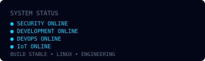

<h1 align="center">Kero Nader</h1>
<p align="center"><b>Cybersecurity Engineer | Full Stack Developer | DevOps & IoT</b></p>
<p align="center">
  <a href="https://github.com/KeroNaderDev"></a>
  <a href="https://www.linkedin.com/in/kero-nader-98732b288/"></a>
  <a href="https://kero.10001mb.com"></a>
</p>

<p align="center"><i>Building, securing, deploying, and integrating complete digital systems — from web applications and infrastructure to embedded devices and IoT.</i></p>

---

### 💻 HERO TERMINAL
```text
┌─────────────────────────────────────────────┐
│ kero@systems:~$                            │
│                                             │
│ $ whoami                                    │
│ Kero Nader                                  │
│                                             │
│ $ role                                      │
│ Cybersecurity Engineer                      │
│                                             │
│ $ stack                                     │
│ Full Stack • DevOps • IoT                   │
│                                             │
│ $ mission                                   │
│ Build • Secure • Deploy • Connect           │
│                                             │
│ SYSTEM STATUS: ONLINE  ●                    │
└─────────────────────────────────────────────┘
```


---

### ✨ About Me — End-to-End Builder


I'm **Kero Nader** — **Systems builder** from **Cairo, Egypt** • Member of **OrcaTech**

> Instead of being *just* a web dev or *just* a pentester, I connect the dots: **React app → Docker → Linux → ESP32 → REST API → DB → Dashboard → Pentest**. That **End-to-End** perspective is my edge.

- 🔒 **30+ Systems Secured** — Pentests & vuln assessments
- 🚀 **15+ Apps & Systems Built** — Full stack + IoT + dashboards
- 🧪 **5+ Years Hands-On** — Labs, production & hardware
- 📍 **Cairo, Egypt** | 🏢 **OrcaTech** | 🌐 [kero.10001mb.com](https://kero.10001mb.com)

**Pipeline:** `ESP32 → Sensors → Wi-Fi → API → Database → Web Dashboard → Security Audit`

### 📊 Complete Skills Overview — All Data Professional

| Domain | Skills & Technologies |
|---|---|
| **Cybersecurity** | Web Application Security, OWASP, Burp Suite, Nmap, Metasploit, Wireshark, Gobuster, ffuf, SQLmap, Vulnerability Assessment |
| **Full Stack** | React, JavaScript, HTML, CSS, Tailwind, Node.js, Express, REST APIs, JWT, RBAC |
| **Backend** | Node.js, Express.js, REST APIs, JWT, RBAC, API Security, Validation |
| **DevOps** | Linux, Docker, Git, GitHub Actions, CI/CD, Nginx, Deployment, Automation |
| **Cloud** | Linux, Docker, Nginx, CI/CD, Deployment, Infrastructure |
| **IoT & Embedded** | ESP32, Arduino, C/C++, Sensors, MQTT, GPIO, UART, I2C, SPI, Embedded Systems, Hardware Integration |

<p align="center"></p>

<br clear="right"/>

---

### 🧠 Core Expertise
**Cybersecurity** — OWASP, Web Pentesting, Burp Suite, Nmap, Wireshark, Vulnerability Assessment
**Full Stack** — React, Node.js, Express.js, REST APIs, JWT, RBAC, MySQL, PostgreSQL, MongoDB
**DevOps** — Linux, Docker, Git, GitHub Actions, CI/CD, Nginx, Deployment
**IoT & Embedded** — ESP32, Arduino, C/C++, Sensors, MQTT, GPIO, UART/I2C/SPI

---

### 🎯 Four Pillars, One Pipeline
<p align="center">
  
  
  
  
</p>

| Pillar | Focus | Key Skills |
|---|---|---|
| ** Cybersecurity** <br/> *Offensive & Defensive* | Pentesting • Web Security | `Kali` `Burp Suite` `Nmap` `Metasploit` `Wireshark` `OWASP Top10` `Red Team` `CVSS` |
| ** Full Stack** <br/> *Frontend • Backend • DB* | Real apps, not demos | `React` `HTML5` `CSS3` `JS ES6+` `Node.js` `Express` `REST` `JWT` `MySQL` `PostgreSQL` `MongoDB` `Firebase` |
| ** DevOps & Cloud** <br/> *Build → Ship → Run* | GitHub → Production | `Linux` `Git` `Docker` `Docker Compose` `CI/CD` `GitHub Actions` `Nginx` `Bash` `SSL` |
| ** Embedded & IoT** <br/> *Where SW meets HW* | Sensors → Cloud dashboards | `Arduino` `ESP32` `Sensors` `GPIO` `UART/I2C/SPI` `C/C++` `Wi-Fi/Bluetooth` `MQTT` |

---

### 🔗 END-TO-END SYSTEM PIPELINE
*Visual identity — FROM CODE TO CLOUD TO HARDWARE*
```text
┌──────────┐
│   CODE   │
└────┬─────┘
     ↓
┌──────────┐
│ SECURITY │
└────┬─────┘
     ↓
┌──────────┐
│  CI/CD   │
└────┬─────┘
     ↓
┌──────────┐
│  DOCKER  │
└────┬─────┘
     ↓
┌──────────┐
│   LINUX  │
└────┬─────┘
     ↓
┌──────────┐
│    API   │
└────┬─────┘
     ↓
┌──────────┐
│ DATABASE │
└────┬─────┘
     ↓
┌──────────┐
│ ESP32 /  │
│   IoT    │
└──────────┘
```


---

### 🛡️ SECURITY OPERATIONS
```text
RECON → SCANNING → ENUMERATION → VULNERABILITY → EXPLOITATION → ANALYSIS → REMEDIATION → REPORT
```

*Tools:* Kali Linux, Burp Suite, Nmap, Metasploit, Wireshark, Gobuster, ffuf, SQLmap, OWASP, CVSS

### 💻 FULL STACK ENGINEERING
```text
USER → FRONTEND → API → BACKEND → DATABASE → AUTH → DOCKER → DEPLOYMENT
```


### ⚙️ DEVOPS / INFRASTRUCTURE
```text
CODE → GITHUB → CI/CD → BUILD → TEST → DOCKER → LINUX → NGINX → SSL → DEPLOYMENT
```


### 🤖 IoT & EMBEDDED SYSTEMS
```text
ESP32 → SENSORS → Wi-Fi / MQTT → REST API → DATABASE → WEB DASHBOARD
```


---

### 🛠 Tech Stack — The Tools I Actually Use
<p align="center">
  
</p>

| Category | Technologies |
|---|---|
| Languages | Python, JavaScript, C/C++, SQL, Bash, HTML, CSS |
| Frontend | React, Tailwind |
| Backend | Node.js, Express, REST APIs, JWT, RBAC |
| Databases | MySQL, PostgreSQL, MongoDB, Firebase |
| Security | Burp Suite, Nmap, Metasploit, Wireshark, Gobuster, ffuf, SQLmap, OWASP |
| DevOps | Git, GitHub, Docker, Linux, GitHub Actions, CI/CD, Nginx |
| Embedded | Arduino, ESP32, Sensors, MQTT, GPIO, I2C, SPI |

---

### 🚀 Featured Projects — Content-Specific

<p align="center">
  
  
  
  
</p>

| Project | Category | Highlights |
|---|---|---|
| ** OWASP Juice Shop — Web Pentest** | `Cybersecurity` | Recon → Report • `Burp` `OWASP` [View Report](https://kero.10001mb.com/report.html) |
| ** Gym Academy System** | `Full Stack` | Members, subs, schedules • `Node.js` `MySQL` `RBAC` |
| ** Kora Academy Platform** | `Full Stack` | Football academy • Auditing |
| ** Android Food — Food Delivery** | `Full Stack` | `Flutter` `Firebase` |
| ** Deployment Pipeline — Docker + Linux** | `DevOps` | `GitHub → CI/CD → Docker → Linux → Nginx → SSL` |
| ** Smart Environmental Monitoring — ESP32** | `IoT` | `ESP32 + DHT22 → Wi-Fi → API → Dashboard` |
| ** Arduino Sensor Lab** | `Embedded` | `Arduino` `C/C++` `GPIO` `I2C/SPI` |

> 🔗 Detailed writeups: **[kero.10001mb.com/#projects](https://kero.10001mb.com/#projects)**

---

### 🧪 ENGINEERING LABS
| [  SECURITY LAB ] | [  DEVELOPMENT LAB ] |
|---|---|
| Kali • Burp • OWASP • VulnHub | React • Node.js • Express • Databases |
| [  DEVOPS LAB ] | [  HARDWARE LAB ] |
| Docker • Linux • CI/CD • Nginx | Arduino • ESP32 • Sensors • IoT |

---

### 📝 SECURITY & ENGINEERING WRITEUPS
| [ SECURITY ] | [ IoT ] |
|---|---|
| **OWASP Juice Shop** — Full Web Pentest Report | **ESP32 → Cloud Dashboard** |
| [ DEVOPS ] | [ LINUX ] |
| **Docker → Production Deployment** | **Server Hardening** |

---

### 📈 SYSTEM STATUS
```text
SYSTEM STATUS
────────────────────
SECURITY       ONLINE  ●
DEVELOPMENT    ONLINE  ●
DEVOPS         ONLINE  ●
IoT            ONLINE  ●
BUILD STATUS   STABLE
ENVIRONMENT    LINUX
MODE           ENGINEERING
```


<p align="center">
  
  <br/><sub>Light SVG — auto-updated daily</sub>
</p>
---

<details>
<summary>📦 All Repositories (14) — Full Data</summary>

| Repository | Description | Language | Visibility | Link |
|---|---|---|---|---|
| `KeroNaderDev` | Profile README — Cyberpunk Portfolio | — | Public | [View](https://github.com/KeroNaderDev/KeroNaderDev) |
| `Kora-gym` | Kora Academy Platform — Football academy | HTML | Private | [View](https://github.com/KeroNaderDev/Kora-gym) |
| `koragym` | Complete Gym Management System | TypeScript | Private | [View](https://github.com/KeroNaderDev/koragym) |
| `webkoragym` | WebKoraGym — Gym Academy web platform | TypeScript | Private | [View](https://github.com/KeroNaderDev/webkoragym) |
| `koragym-dashboard` | Admin dashboard — Analytics/RBAC | TypeScript | Private | [View](https://github.com/KeroNaderDev/koragym-dashboard) |
| `insight-ai` | ESP32 Environmental Monitoring — AI | TypeScript | Private | [View](https://github.com/KeroNaderDev/insight-ai) |
| `locaandcam` | Location & Camera — ESP32 IoT | HTML | Private | [View](https://github.com/KeroNaderDev/locaandcam) |
| `api-mask` | Secure API Proxy & Masking | JavaScript | Private | [View](https://github.com/KeroNaderDev/api-mask) |
| `smm-bot` | Telegram SMM Bot — Foollo API | Python | Private | [View](https://github.com/KeroNaderDev/smm-bot) |
| `saasagnet` | SaaS Agent Platform — AI Automation | TypeScript | Private | [View](https://github.com/KeroNaderDev/saasagnet) |
| `mina` | Mina Travel — Booking platform | — | Private | [View](https://github.com/KeroNaderDev/mina) |
| `BotWhatsap` | WhatsApp Automation Bot | — | Private | [View](https://github.com/KeroNaderDev/BotWhatsap) |
| `mast7elgarema` | Management System — Full Stack | JavaScript | Private | [View](https://github.com/KeroNaderDev/mast7elgarema) |
| `KerolosNader19` | Legacy Profile README | — | Public | [View](https://github.com/KeroNaderDev/KerolosNader19) |

*All private repos include architecture + security notes in README — ready to make public for showcase.*
</details>

### 📫 Let's Connect
*Interested in Cybersecurity, Full Stack, DevOps, Backend, IoT/Embedded roles.*

- **GitHub:** https://github.com/KeroNaderDev
- **LinkedIn:** https://www.linkedin.com/in/kero-nader-98732b288/
- **Portfolio:** https://kero.10001mb.com


