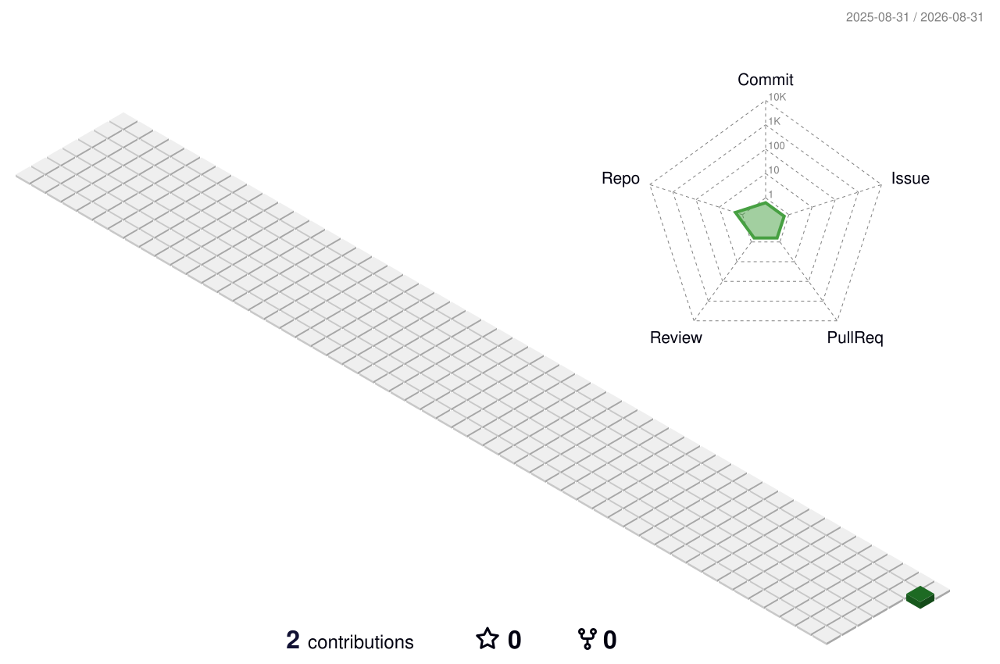

<!-- 
  README.md احترافي لـ Kero Nader — Dark Theme
  كل قسم عليه تعليق عربي عشان تعدل بسهولة — دور على PLACEHOLDER و EDIT HERE
-->

<!-- ========== 1. بانر أنيميشن 3D + ترحيب ديناميكي ========== -->

<!-- تايبينغ أنيميشن — EDIT HERE: غير الأسطر اللي بتتكتب -->

  

  <!-- PLACEHOLDER: غير اللينكات هنا — EDIT HERE -->
  
  
  
  
  

<!-- ========== 3D Illustration بانر ثانوي ========== -->

  

---

<!-- ========== 2. إحصائيات متحركة — Dark Theme ========== -->
<!-- EDIT HERE: كلها بتتحدث تلقائياً من GitHub API -->

  
  

  
  

  

---

<!-- ========== 3. شهادات المهارات — Hover Animation ========== -->
<!-- EDIT HERE: ضيف أو شيل أي تكنولوجيا من القائمة — Skillicons + Simple Icons -->
<h3 align="center">🛠️ Tech Stack — Hover to Scale</h3>

  <!-- الصف الأول: اللغات -->
  
   
  <!-- الصف الثاني: Backend & DB & DevOps & Embedded -->
  

<!-- أيقونات إضافية بـ simple-icons مع Hover Scale — تقدر تغير الألوان -->

  
  
  
  
  

---

<!-- ========== 4. مشاريع مميزة — 3 فقط مع صور ========== -->
<!-- EDIT HERE: غير الصور والوصف واللينكات — PLACEHOLDER لكل مشروع -->
<h3 align="center">🚀 Featured Projects — 3 Highlights</h3>

<table align="center">
<tr>
<td width="33%" align="center">
  <a href="https://kero.10001mb.com/projects/juice-shop-pentest.html">
    
     <strong>OWASP Juice Shop — Pentest</strong>
  </a>
   Recon → Exploitation → Report • Burp • OWASP
   
  
  
</td>
<td width="33%" align="center">
  <a href="https://kero.10001mb.com/projects/kora-platform.html">
    
     <strong>Kora Academy Platform</strong>
  </a>
   Football academy • Evaluation • Financial Auditing
   
  
  
</td>
<td width="33%" align="center">
  <a href="https://kero.10001mb.com/projects/esp32-monitoring.html">
    
     <strong>Smart ESP32 Monitoring</strong>
  </a>
   ESP32 + DHT22 → Wi-Fi → API → Dashboard
   
  
  
</td>
</tr>
</table>

<!-- ========== لمسة فنية: Snake + 3D Contrib + Visitor Counter ========== -->
<h3 align="center">🐍 3D & Snake — لمسة فنية</h3>

  <!-- Snake المتحرك — بيتحدث يومياً -->
  
   Snake animation — contributions graph (auto-updated daily)

  <!-- 3D Contribution — EDIT HERE: لو عايز تغير اللون غير green لـ blue/purple -->
  
  3D Contrib will appear after first 3D workflow run — see Actions tab

  
  
  

---

<!-- ========== Footer ========== -->

<!-- 
  نصيحة ذهبية: أي PLACEHOLDER فوق تقدر تغيره — دور على EDIT HERE
  الألوان: غير 00d2ff, 3a7bd5, 0f172a, ff3b5c في الروابط لتغيير الثيم
-->
